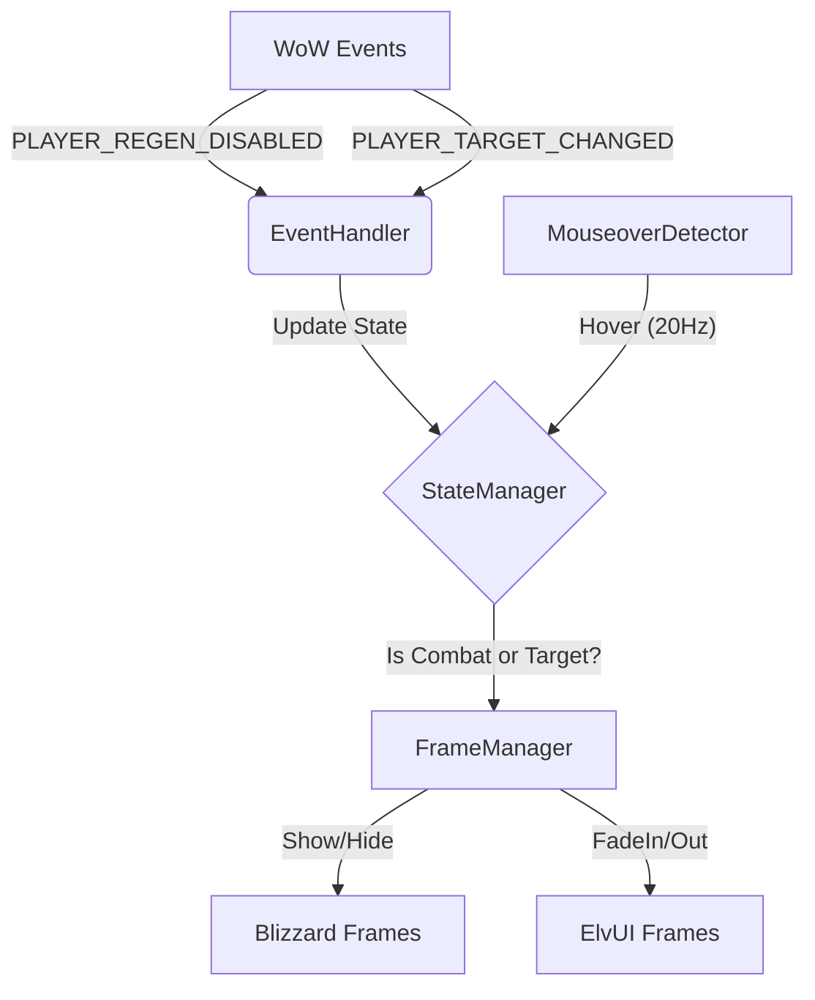

<picture>
  <source media="(prefers-color-scheme: dark)" srcset="https://img.shields.io/badge/ZenHUD-Minimalist%20UI%20Automation-8b5cf6?style=for-the-badge&logo=data:image/svg+xml;base64,PHN2ZyB4bWxucz0iaHR0cDovL3d3dy53My5vcmcvMjAwMC9zdmciIHdpZHRoPSIyNCIgaGVpZ2h0PSIyNCIgdmlld0JveD0iMCAwIDI0IDI0IiBmaWxsPSJub25lIiBzdHJva2U9IiNmZmZmZmYiIHN0cm9rZS13aWR0aD0iMiIgc3Ryb2tlLWxpbmVjYXA9InJvdW5kIiBzdHJva2UtbGluZWpvaW49InJvdW5kIj48Y2lyY2xlIGN4PSIxMiIgY3k9IjEyIiByPSIxMCIvPjxwYXRoIGQ9Ik0xMiA2djZsNCAyIi8+PC9zdmc+">
  <source media="(prefers-color-scheme: light)" srcset="https://img.shields.io/badge/ZenHUD-Minimalist%20UI%20Automation-8b5cf6?style=for-the-badge&logo=data:image/svg+xml;base64,PHN2ZyB4bWxucz0iaHR0cDovL3d3dy53My5vcmcvMjAwMC9zdmciIHdpZHRoPSIyNCIgaGVpZ2h0PSIyNCIgdmlld0JveD0iMCAwIDI0IDI0IiBmaWxsPSJub25lIiBzdHJva2U9IiMwMDAwMDAiIHN0cm9rZS13aWR0aD0iMiIgc3Ryb2tlLWxpbmVjYXA9InJvdW5kIiBzdHJva2UtbGluZWpvaW49InJvdW5kIj48Y2lyY2xlIGN4PSIxMiIgY3k9IjEyIiByPSIxMCIvPjxwYXRoIGQ9Ik0xMiA2djZsNCAyIi8+PC9zdmc+">
  
</picture>

<p align="center">
  <strong>Intelligent UI visibility management for World of Warcraft 3.3.5a</strong><br>
  Your UI appears when you need it, vanishes when you don't. Zero configuration.
</p>

<p align="center">
  <a href="https://github.com/Zendevve/ZenHUD/releases"></a>
  <a href="https://github.com/Zendevve/ZenHUD/blob/main/LICENSE"></a>
  <a href="https://github.com/Zendevve/ZenHUD"></a>
  <a href="https://github.com/Zendevve/ZenHUD/commits/main"></a>
</p>

---

## Table of Contents

- [Why ZenHUD?](#why-ZenHUD)
- [Features](#features)
- [Installation](#installation)
- [Usage](#usage)
- [Configuration](#configuration)
- [ElvUI / Tukui Support](#elvui--tukui-support)
- [Architecture](#architecture)
- [Contributing](#contributing)
- [Code of Conduct](#code-of-conduct)
- [License](#license)

---

## Why ZenHUD?

> **Problem**: The default WoW UI clutters your screen during exploration, obscuring the beautiful world Blizzard created.
>
> **Solution**: ZenHUD serves as an intelligent display driver. It automatically hides your action bars, unit frames, and buffs when they are irrelevant, and instantly restores them when combat starts, you target an entity, or mouse over the UI area.

| Feature | ZenHUD | Manual Hiding | Other Addons |
|---------|:-----:|:-------------:|:------------:|
| Zero Configuration | ✅ | ❌ | ⚠️ |
| Combat Safety | ✅ Instant | ❌ | ⚠️ |
| Smooth Animations | ✅ | ❌ | ⚠️ |
| ElvUI Support | ✅ | N/A | ❌ |
| Lightweight (~900 LOC) | ✅ | N/A | ❌ |

---

## Features

### Smart Automation
- **Combat**: UI appears instantly (0ms latency) when combat starts to ensure safety.
- **Targeting**: UI shows automatically when you select a valid target.
- **Mouseover**: Hovering over the bottom or side bar areas gracefully fades them in.
- **Resting**: Full UI visibility is maintained in cities and inns for convenience.

### Performance
- **Throttled Detection**: Uses 20Hz polling for mouseover detection to reduce CPU cycles compared to standard 60Hz loops.
- **FadeOnly Mode**: For ElvUI users, ZenHUD manipulates alpha channels only, preventing "Action Blocked by AddOn" taint errors.
- **Single Update Loop**: All logic runs in a unified controller to minimize overhead.

### Customization
- **Frame Groups**: Toggle visibility logic for Action Bars, Unit Frames, and Buffs independently.
- **Fade Time**: Configurable animation duration (0.1s - 2.0s).
- **Faded Opacity**: "Ghost Mode" support (e.g., set hidden opacity to 20% instead of 0%).
- **Per-Character Settings**: Support for alt-specific configurations.

---

## Installation

### Prerequisites
- World of Warcraft **3.3.5a** (WotLK Client)
- No external dependencies required.

### Steps

1. **Download** the latest release artifact from the [Releases Page](https://github.com/Zendevve/ZenHUD/releases).
2. **Extract** the contents to your AddOns directory:
   ```bash
   <WoW Root>/Interface/AddOns/ZenHUD/
   ```
3. **Verify** the folder structure:
   ```text
   ZenHUD/
     ├── ZenHUD.toc
     ├── ZenHUD.lua
     ├── Config.lua
     └── ...
   ```
4. **Launch** World of Warcraft. ZenHUD will initialize automatically upon login.

---

## Usage

### Demo

> [!TIP]
> **Action Required**: Replace this placeholder with a GIF or Screencast showing ZenHUD in action (e.g., entering combat, targeting a mob).
>
> ``

### Slash Commands

| Command | Description |
|:---|:---|
| `/ZenHUD` | Show help menu |
| `/ZenHUD options` | Open settings panel |
| `/ZenHUD toggle` | Enable/disable addon |
| `/ZenHUD status` | Print current internal state to chat |
| `/ZenHUD frames` | List all frames currently under control |
| `/ZenHUD debug` | Toggle verbose debug logging |

### Minimap Button
- **Left Click**: Toggle ZenHUD on/off.
- **Right Click**: Open options panel.
- **Drag**: Reposition around minimap.
- **To Hide**: Use `/ZenHUD minimap` to toggle visibility.

---

## Configuration

Settings can be managed via the in-game GUI (`/ZenHUD options`) or by editing the `SavedVariables` file directly.

**File Path**: `WTF/Account/<AccountName>/SavedVariables/ZenHUD.lua`

| Option | Type | Default | Description |
| :--- | :--- | :--- | :--- |
| **enabled** | `boolean` | `true` | Master switch for the addon. |
| **fadeTime** | `number` | `0.8` | Duration of the fade animation (in seconds). |
| **fadedAlpha** | `number` | `0.0` | Opacity when UI is hidden (0.0 = invisible, 0.5 = ghost). |
| **gracePeriods.combat** | `number` | `8.0` | Seconds to keep UI shown after leaving combat. |
| **gracePeriods.target** | `number` | `2.0` | Seconds to keep UI shown after deselection. |
| **gracePeriods.mouseover** | `number` | `2.0` | Seconds to keep UI shown after mouse leaves. |
| **frameGroups.actionBars** | `boolean` | `true` | Manage Blizzard/ElvUI action bars. |
| **frameGroups.unitFrames** | `boolean` | `true` | Manage Player, Target, Pet frames. |
| **frameGroups.buffs** | `boolean` | `true` | Manage Buffs and Debuffs. |

<details>
<summary><strong>Advanced Configuration (JSON Structure)</strong></summary>

```lua
ZenHUDDB = {
    enabled = true,
    fadeTime = 0.8,
    fadedAlpha = 0.0,
    gracePeriods = {
        combat = 8.0,
        target = 2.0,
        mouseover = 2.0,
    },
    frameGroups = {
        actionBars = true,
        unitFrames = true,
        buffs = true,
        elvui = true,
    },
}
```
</details>

---

## Architecture

ZenHUD follows a strict event-driven architecture to minimize CPU usage (targeting <0.1% CPU utilization). It eschews `OnUpdate` loops for everything except animation interpolation and throttled mouse polling.



---

## Contributing

We welcome contributions! Please see our [Contributing Guide](docs/CONTRIBUTING.md) for details on development setup, code style, and submission process.

## Code of Conduct

Please review our [Code of Conduct](docs/CODE_OF_CONDUCT.md) before participating in the community.

## ElvUI / Tukui Support

ZenHUD automatically detects ElvUI/Tukui environments. It switches to a "Fade-Only" mode which manipulates the alpha channel instead of frame visibility (`:Show()`/`:Hide()`) to ensure compatibility with ElvUI's internal hook systems.

## License

This project is licensed under the MIT License - see the [LICENSE](LICENSE) file for details.
