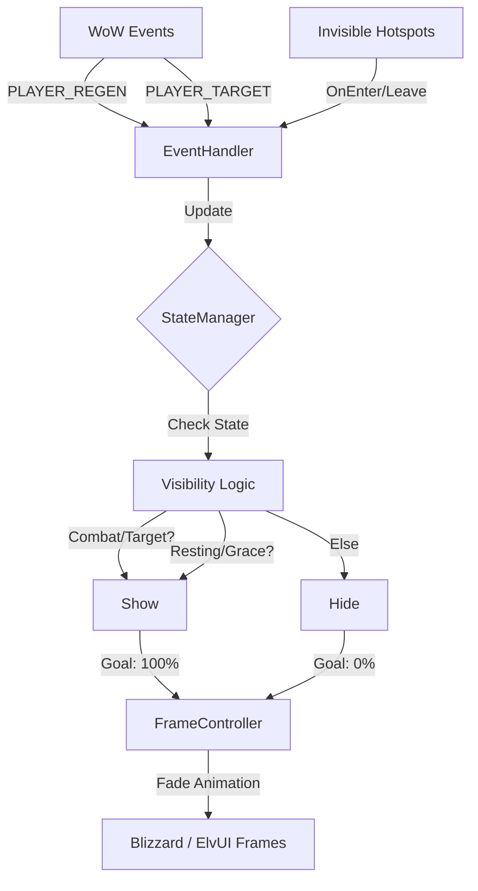

<picture>
  <source media="(prefers-color-scheme: dark)" srcset="https://img.shields.io/badge/ZenHUD-Minimalist%20UI%20Automation-8b5cf6?style=for-the-badge&logo=data:image/svg+xml;base64,PHN2ZyB4bWxucz0iaHR0cDovL3d3dy53My5vcmcvMjAwMC9zdmciIHdpZHRoPSIyNCIgaGVpZ2h0PSIyNCIgdmlld0JveD0iMCAwIDI0IDI0IiBmaWxsPSJub25lIiBzdHJva2U9IiNmZmZmZmYiIHN0cm9rZS13aWR0aD0iMiIgc3Ryb2tlLWxpbmVjYXA9InJvdW5kIiBzdHJva2UtbGluZWpvaW49InJvdW5kIj48Y2lyY2xlIGN4PSIxMiIgY3k9IjEyIiByPSIxMCIvPjxwYXRoIGQ9Ik0xMiA2djZsNCAyIi8+PC9zdmc+">
  <source media="(prefers-color-scheme: light)" srcset="https://img.shields.io/badge/ZenHUD-Minimalist%20UI%20Automation-8b5cf6?style=for-the-badge&logo=data:image/svg+xml;base64,PHN2ZyB4bWxucz0iaHR0cDovL3d3dy53My5vcmcvMjAwMC9zdmciIHdpZHRoPSIyNCIgaGVpZ2h0PSIyNCIgdmlld0JveD0iMCAwIDI0IDI0IiBmaWxsPSJub25lIiBzdHJva2U9IiMwMDAwMDAiIHN0cm9rZS13aWR0aD0iMiIgc3Ryb2tlLWxpbmVjYXA9InJvdW5kIiBzdHJva2UtbGluZWpvaW49InJvdW5kIj48Y2lyY2xlIGN4PSIxMiIgY3k9IjEyIiByPSIxMCIvPjxwYXRoIGQ9Ik0xMiA2djZsNCAyIi8+PC9zdmc+">
  
</picture>

  <strong>Intelligent UI visibility management for World of Warcraft 3.3.5a</strong> 
  Your UI appears when you need it, vanishes when you don't. Zero configuration.

  
  
  
  

---

[Why ZenHUD?](#why-Zenhud) • [Features](#features) • [Installation](#installation) • [Usage](#usage) • [Configuration](#configuration) • [Architecture](#architecture)

---

## Why ZenHUD?

> **Problem**: The default WoW UI clutters your screen during exploration, obscuring the beautiful world Blizzard created.
>
> **Solution**: ZenHUD serves as an intelligent display driver. It automatically hides your action bars, unit frames, and buffs when they are irrelevant, and instantly restores them when combat starts, you target an entity, or mouse over the UI area.

| Feature | ZenHUD | Manual Hiding | Other Addons |
| :--- | :---: | :---: | :---: |
| **Zero Configuration** | ✅ | ❌ | ⚠️ |
| **Combat Safety** | ✅ Instant (0ms) | ❌ | ⚠️ |
| **ElvUI Detection** | ✅ Native | N/A | ❌ |
| **Performance** | ✅ Event-Driven | N/A | ⚠️ Polling |

---

## Features

### Smart Automation
- **Combat**: UI appears instantly (0ms latency) via `PLAYER_REGEN_DISABLED` event.
- **Targeting**: UI shows automatically when you select a valid, living target.
- **Hover Hotspots**: Main maintains invisible "Hotspot" frames over UI areas. When your mouse enters these empty spaces, the UI fades in. No CPU polling required.
- **Zone Awareness**: Automatically keeps UI shown in Dungeons, Raids, Arenas, and Battlegrounds (Configurable).

### Performance Architecture
- **Zero-Polling**: Unlike other addons that check `MouseIsOver()` 60 times a second, ZenHUD uses `OnEnter`/`OnLeave` scripts on invisible frames.
- **FadeOnly Mode**: Detects ElvUI and switches to Alpha-channel manipulation to prevent "Action Blocked" taint errors.
- **Debounced Zone Checks**: Zone changes are debounced (0.6s) to prevent script thrashing during loading screens.

---

## Installation

1. **Download** the latest release from the [Releases Page](https://github.com/Zendevve/ZenHUD/releases).
2. **Extract** to `<WoW Root>/Interface/AddOns/ZenHUD/`.
3. **Verify** you see `ZenHUD.toc` and `Config.lua`.

---

## Usage

### Demo

> [!TIP]
> **Action Required**: Replace this placeholder with a GIF or Screencast showing ZenHUD in action (e.g., entering combat, targeting a mob).
>
> ``

### Slash Commands

| Command | Arguments | Description |
| :--- | :--- | :--- |
| `/ZenHUD` | | Show help menu |
| `/ZenHUD options` | | Open GUI settings |
| `/ZenHUD toggle` | | Enable/disable addon |
| `/ZenHUD fade` | `<seconds>` | Set animation duration |
| `/ZenHUD grace` | `<type> <sec>` | Set grace period (combat, target, mouseover) |
| `/ZenHUD character` | | Toggle Per-Character settings mode |
| `/ZenHUD profile` | `save/load <name>` | Manage setting profiles |
| `/ZenHUD minimap` | | Toggle minimap button |
| `/ZenHUD status` | | Show debug status |

---

## Configuration

Settings can be managed via `/ZenHUD options` or `Config.lua`.

### Core Settings

| Option | Default | Description |
| :--- | :--- | :--- |
| **fadeTime** | `0.8` | Animation duration in seconds. |
| **fadedAlpha** | `0.0` | Opacity when hidden (0.0 = invisible, 0.2 = dim). |
| **showOnTarget** | `true` | Show UI when you have a target. |

### Zone Overrides
By default, ZenHUD keeps the UI **always visible** in dangerous instances:
- Dungeons
- Raids
- Arenas
- Battlegrounds

### Controlled Frames
ZenHUD manages visibility for the following groups:

<strong>View Frame List</strong>

| Group | Frames |
| :--- | :--- |
| **Action Bars** | `MainMenuBar`, `MultiBarBottomLeft/Right`, `MultiBarLeft/Right`, `PetActionBar`, `ShapeshiftBar`, `VehicleMenuBar` |
| **Unit Frames** | `PlayerFrame`, `PetFrame`, `TargetFrameToT` |
| **Chat** | `ChatFrameMenuButton`, `ChatFrame1` buttons |
| **Quest** | `WatchFrame`, `QuestWatchFrame`, `QuestTimerFrame` |
| **Misc** | `Minimap`, `BuffFrame`, `XPBar`, `ReputationBar`, `Bags` |

---

## Architecture

ZenHUD uses a **State Machine** pattern coupled with **Event-Driven** inputs.

## Contributing
See [CONTRIBUTING.md](docs/CONTRIBUTING.md) for development setup and Lua style guides.

## License
MIT License. See [LICENSE](LICENSE).
