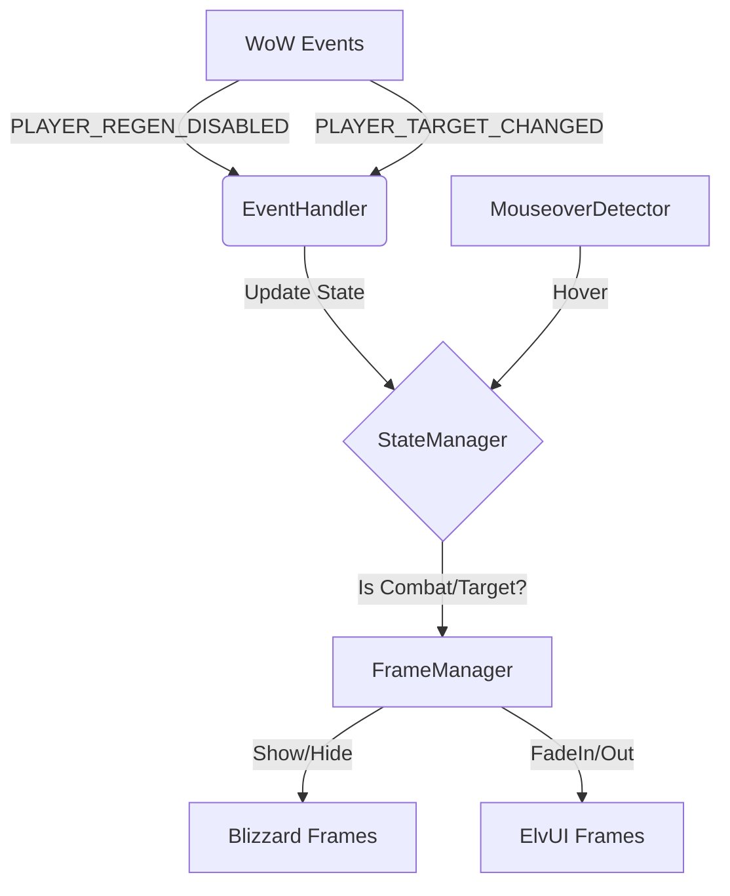

<picture>
  <source media="(prefers-color-scheme: dark)" srcset="https://img.shields.io/badge/ZenHUD-Minimalist%20UI%20Automation-8b5cf6?style=for-the-badge&logo=data:image/svg+xml;base64,PHN2ZyB4bWxucz0iaHR0cDovL3d3dy53My5vcmcvMjAwMC9zdmciIHdpZHRoPSIyNCIgaGVpZ2h0PSIyNCIgdmlld0JveD0iMCAwIDI0IDI0IiBmaWxsPSJub25lIiBzdHJva2U9IiNmZmZmZmYiIHN0cm9rZS13aWR0aD0iMiIgc3Ryb2tlLWxpbmVjYXA9InJvdW5kIiBzdHJva2UtbGluZWpvaW49InJvdW5kIj48Y2lyY2xlIGN4PSIxMiIgY3k9IjEyIiByPSIxMCIvPjxwYXRoIGQ9Ik0xMiA2djZsNCAyIi8+PC9zdmc+">
  <source media="(prefers-color-scheme: light)" srcset="https://img.shields.io/badge/ZenHUD-Minimalist%20UI%20Automation-8b5cf6?style=for-the-badge&logo=data:image/svg+xml;base64,PHN2ZyB4bWxucz0iaHR0cDovL3d3dy53My5vcmcvMjAwMC9zdmciIHdpZHRoPSIyNCIgaGVpZ2h0PSIyNCIgdmlld0JveD0iMCAwIDI0IDI0IiBmaWxsPSJub25lIiBzdHJva2U9IiMwMDAwMDAiIHN0cm9rZS13aWR0aD0iMiIgc3Ryb2tlLWxpbmVjYXA9InJvdW5kIiBzdHJva2UtbGluZWpvaW49InJvdW5kIj48Y2lyY2xlIGN4PSIxMiIgY3k9IjEyIiByPSIxMCIvPjxwYXRoIGQ9Ik0xMiA2djZsNCAyIi8+PC9zdmc+">
  
</picture>

<p align="center">
  <strong>Intelligent UI visibility management for World of Warcraft 3.3.5a</strong><br>
  Your UI appears when you need it, vanishes when you don't. Zero configuration.
</p>

<p align="center">
  <a href="https://github.com/Zendevve/ZenHUD/releases"></a>
  <a href="https://github.com/Zendevve/ZenHUD/blob/main/LICENSE"></a>
  <a href="https://github.com/Zendevve/ZenHUD"></a>
  <a href="https://github.com/Zendevve/ZenHUD/commits/main"></a>
</p>

---

## Table of Contents

- [Why ZenHUD?](#why-ZenHUD)
- [Features](#features)
- [Installation](#installation)
- [Usage](#usage)
- [Configuration](#configuration)
- [ElvUI / Tukui Support](#elvui--tukui-support)
- [Architecture](#architecture)
- [Contributing](#contributing)
- [Code of Conduct](#code-of-conduct)
- [License](#license)

---

## Why ZenHUD?

> **Problem**: The default WoW UI clutters your screen during exploration, obscuring the beautiful world Blizzard created.
>
> **Solution**: ZenHUD automatically hides your action bars, unit frames, and buffs when you don't need them, and instantly shows them when combat starts, you target something, or hover over the UI area.

| Feature | ZenHUD | Manual Hiding | Other Addons |
|---------|:-----:|:-------------:|:------------:|
| Zero Configuration | ✅ | ❌ | ⚠️ |
| Combat Safety | ✅ Instant | ❌ | ⚠️ |
| Smooth Animations | ✅ | ❌ | ⚠️ |
| ElvUI Support | ✅ | N/A | ❌ |
| Lightweight (~900 LOC) | ✅ | N/A | ❌ |

---

## Features

### Smart Automation
- **Combat**: UI appears instantly when combat starts
- **Targeting**: UI shows when you select a living target
- **Mouseover**: Hover action bars to reveal them
- **Resting**: Full UI in cities and inns
- **Grace Periods**: Smooth transitions, no flickering

### Performance
- **Throttled Detection**: 20Hz mouseover polling (not 60Hz)
- **FadeOnly Mode**: Alpha-only changes for ElvUI (no taint)
- **Single Update Loop**: Minimal CPU overhead

### Customization
- **Frame Groups**: Toggle action bars, unit frames, buffs independently
- **Fade Time**: 0.1s to 2.0s configurable
- **Faded Opacity**: 0% to 100% (ghost mode)
- **Per-Character Settings**: Different configs per alt

---

## Installation

### Prerequisites
- World of Warcraft **3.3.5a** (WotLK)
- No other dependencies

### Steps

```bash
# 1. Download the latest release
# 2. Extract to your AddOns folder
<WoW Install>/Interface/AddOns/ZenHUD/

# 3. Verify folder structure
ZenHUD/
  ├── ZenHUD.toc
  ├── ZenHUD.lua
  ├── Config.lua
  └── ... (other .lua files)
```

4. Launch WoW →  ZenHUD activates automatically after 5 seconds

---

## Usage

### Demo

> [!TIP]
> **Action Required**: Replace this placeholder with a GIF or Screencast showing ZenHUD in action (e.g., entering combat, targeting a mob).
>
> ``

### Slash Commands

```
/ZenHUD              Show help
/ZenHUD options      Open settings panel
/ZenHUD toggle       Enable/disable addon
/ZenHUD status       Show current state
/ZenHUD frames       List controlled frames
/ZenHUD debug        Toggle debug messages
```

### Minimap Button

| Click | Action |
|-------|--------|
| **Left** | Toggle ZenHUD on/off |
| **Right** | Open options panel |
| **Drag** | Reposition around minimap |

To hide the minimap button, use `/ZenHUD minimap` (toggle).

### Settings

| Setting | Command | Example |
|---------|---------|---------|
| Fade Time | `/ZenHUD fade <sec>` | `/ZenHUD fade 0.5` |
| Combat Grace | `/ZenHUD grace combat <sec>` | `/ZenHUD grace combat 10` |
| Target Grace | `/ZenHUD grace target <sec>` | `/ZenHUD grace target 3` |

Or use **`/ZenHUD options`** for a visual settings panel.

---

## Configuration

Edit `WTF/Account/<Account>/SavedVariables/ZenHUD.lua` or use `/ZenHUD options`.

| Option | Type | Default | Description |
| :--- | :--- | :--- | :--- |
| **enabled** | `boolean` | `true` | Master switch for the addon. |
| **fadeTime** | `number` | `0.8` | Duration of the fade animation (in seconds). |
| **fadedAlpha** | `number` | `0.0` | Opacity when UI is hidden (0.0 = invisible, 0.5 = ghost). |
| **gracePeriods.combat** | `number` | `8.0` | Seconds to keep UI shown after leaving combat. |
| **gracePeriods.target** | `number` | `2.0` | Seconds to keep UI shown after deselection. |
| **gracePeriods.mouseover** | `number` | `2.0` | Seconds to keep UI shown after mouse leaves. |
| **frameGroups.actionBars** | `boolean` | `true` | Manage Blizzard/ElvUI action bars. |
| **frameGroups.unitFrames** | `boolean` | `true` | Manage Player, Target, Pet frames. |
| **frameGroups.buffs** | `boolean` | `true` | Manage Buffs and Debuffs. |

<details>
<summary><strong>Advanced Configuration (JSON)</strong></summary>

```lua
ZenHUDDB = {
    enabled = true,
    fadeTime = 0.8,
    fadedAlpha = 0.0,
    gracePeriods = {
        combat = 8.0,
        target = 2.0,
        mouseover = 2.0,
    },
    frameGroups = {
        actionBars = true,
        unitFrames = true,
        buffs = true,
        elvui = true,
    },
}
```
</details>

---

## Architecture

ZenHUD follows a strict event-driven architecture to minimize CPU usage (0.1% CPU).



## Contributing

We welcome contributions! Please see our [Contributing Guide](docs/CONTRIBUTING.md) for details on how to get started.

## Code of Conduct

Please review our [Code of Conduct](docs/CODE_OF_CONDUCT.md) before participating.

## ElvUI / Tukui Support

ZenHUD automatically detects and controls ElvUI/Tukui frames:
