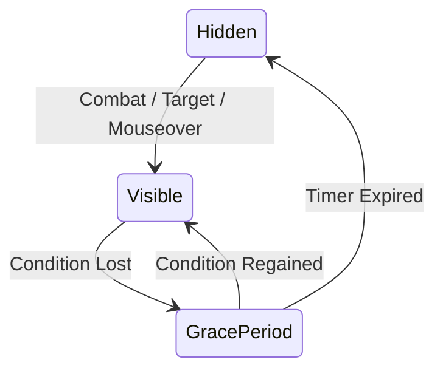

# Feature: Auto Visibility

**Status**: Implemented
**Owner**: ZenHUD

## 1. Purpose
To automatically manage user interface visibility based on game state, ensuring players have a clear view of the world when exploring and critical information when fighting.

## 2. Business Rules & Constraints
*   **Priority Logic**: Combat > Target > Mouseover > Grace Period > Resting > Vehicle.
*   **Combat Safety**: UI must ALWAYS show immediately when entering combat to prevent inability to use abilities.
*   **Grace Periods**: UI should not disappear instantly when leaving conditions (e.g., losing target), but linger for a configurable time.
*   **Zone Debounce**: Transitions should be delayed during "Entering Zone" events to prevent flicker/clipping with zone text.

## 3. User Flows / Interaction
1.  **Exploration**: Player runs around -> UI is Hidden.
2.  **Combat**: Player enters combat -> UI Fades In immediately.
3.  **Targeting**: Player selects a target -> UI Fades In.
4.  **Mouseover**: Player moves mouse to bottom/side of screen -> UI Fades In.
5.  **Idle**: Player enters an Inn -> UI Fades In (Resting state).

